# **Keep It Sweet**

**[Link to the Deployed Site](https://keep-it-sweet-2ecaa2229785.herokuapp.com/)**

# Project Overview

Keep It Sweet is a fictitious, ecommerce full stack project built using Django, Python, JavaScript and Bootstrap 4. The site is deployed to Heroku, uses Amazon S3 for cloud storage and Stripe for payment processing.

It has been produced as my fourth milestone project for Code Institute's Level 5 Diploma in Web Application Development (Full Stack Software Development).
 

---

## TABLE OF CONTENTS

* [User Experience](#user-experience)
    * [User Stories](#user-stories)
* [Design](#design)    
    * [Typography](#typography)
    * [Colour Scheme](#colour-scheme)
    * [Wireframes](#wireframes)
* [Database Design](#database-design)
    * [Relational Database](#relational-database)
    * [Entity Relationship Diagram](#entity-relationship-diagram)
* [Models](#models)
    * [Custom Models](#custom-models)
* [Features](#features)
* [Technologies Used](#technologies-used)
    * [Front End Technologies](#front-end-technologies)
    * [Back End Technologies](#back-end-technologies)
    * [Additional Technologies](#additional-technologies)
* [Testing](#testing)
* [Deployment](#deployment)
* [Credits](#credits)
    * [Code](#code) 
    * [Content](#content)
    * [Media](#media) 
    * [Acknowledgements](#acknowledgements)

---

## User Experience (UX)

-   ### User stories

| **USER STORY #** | **As a/an** | **I want to be able to...** | **So that I can...** |
| --- | --- | --- | --- |
| **VIEWING & NAVIGATION** |   |   |
| 1 | First time user | Navigate around the site | View a list of products  |
| 2 | First time user | Easily and quickly understand the main purpose and products of the 'Keep it Sweet' company | Be sure I am in the right place for my needs  |
| 3 | First time user | View and search specific categories of products | Quickly access a range of products I may be interested in.  |
| 4 | First time user | View individual product details | Identify the price, description, product reviews, product image.  |
| 5 | First time user | View the total amount of products in my shopping bag | Keep track of spending  |
| 6 | First time user | View customer reviews of previous Keep it Sweet's customers | Feel safe in the knowledge that I will be treated well as a customer and feel confident about my purchase.  |
| **REGISTRATION & USER ACCOUNTS** |   |   |
| 7 | First time user | Easily register for an account | Have a personal account and be able to view my profile |
| 8 | First time user | Recieve an email after the above registration process| Have feedback that my registration was successful |
| 9 | Returning user | Easily log in and log out of my account| Access my personal information |
| 10 | Returning/ frequent user | Have a personalised user profile | Access my stored information, order history, order confirmations (and wishlist/ faves list) |
| **SORTING & SEARCHING** |   |   |
| 11 | First time user | Sort the list of available products | Easily identify categorically sorted products |
| 12 | First time user | Search for a product or multiple products by name, ingredient or description | Find a specific product |
| 13 | First time user | View the search results | Identify products for more research or purchase |
| **PURCHASING & CHECKOUT** |   |   |
| 14 | First time user | Select the quantity of a product when purchasing | Ensure the correct quantity is purchased to meet customer need |
| 15 | First time user | View notifications/ feedback when a product is added to the basket | recieve immediate feedback if action completed |
| 16 | First time user | View items in my basket to be purchased | quickly see the total cost of items |
| 17 | First time user | VEdit/ update the items in my basket and adjust quantities | Ensure my purchase is exactly what I want |
| 18 | First time user | Enter payment information | Checkout with minimal fuss. |
| 19 | First time user | Recieve cnfirmation of my order | know my payment has gone through and that my order is in the system. |
| **SITE ADMIN** |   |   |
| 20 | Store Owner | Add a product | Add new items to my store |
| 21 | Store Owner | Edit/ update a product | Amend a product's information so site info is up to date |
| 22 | Store Owner | Delete a product | Remove items that are no longer for sale |
| **DIGITAL MARKETING** |   |   |
| 23 | Store Owner |     Signpost customers to social media. | Build a community of repeat customers to drive sales |
| 24 | Store Owner |     Signpost customers digital marketing (newsletter) and special offers | Build a community of repeat customers to drive sales |
| 25 | Customer |     Access site's social media | Access special offers, be updated on new products and read other reviews. |
| 26 | Customer |     Sign up to digital marketing (Newsletter) | Access special offers, be updated on new products |
| **PRODUCT REVIEWS** |   |   |
| 27 | First time user | View reviews for a product I am viewing | be made aware of previous customer's views |
| 28 | Returning/ frequent user | Be able to add my own reviews to purchased products | share my experiences of a product I purchased |
| 29 | Returning/ frequent user | Be able to edit my own reviews to purchased products | maintain control of my published content |
| 30 | Returning/ frequent user | Be able to delete my own reviews to purchased products | maintain control of my published content |
| **USER FAVOURITES LIST** |   |   |
| 31 | Returning/ frequent user | Add favourite products to a 'Faves -list' | Access quickly in the future for speedier purchase |
| 32 | Returning/ frequent user | Remove favourite products to a 'Faves -list' | Keep products I really like and personalise my list to my own tastes |

---

## Design:

### Typography

The **Keep It Sweet** project uses carefully chosen fonts to enhance the visual appeal and readability of the website. Here's a breakdown of the typography used:

#### Fonts
1. **Poppins** (Default Font)
   - Applied across most body text for a clean and modern appearance.
   - Ensures high readability and a professional look.

2. **Oleo Script** (Heading and Emphasized Text)
   - Used for headings, emphasized text, and decorative elements.
   - Provides a playful and elegant feel that complements the shop's theme.

#### Font Weights
- **700 (Bold)**: Used for headings, emphasized text, and key elements like prices and totals, ensuring important information stands out.

#### Usage
- **Headings and Decorative Elements**:
  - All headings (`h1` to `h6`), `.grand-total`, `.price`, and `.card-body p` use the `Oleo Script` font to create a sense of fun and excitement.
- **Body Text**:
  - General body text and paragraphs (`p`) use the `Poppins` font for readability and simplicity.
- **Buttons and Reviews**:
  - Buttons (`.btn`, `.add-review-btn`) and review content (`.review-content`) also leverage `Poppins` for uniformity and clarity.

#### Fallback Fonts
Both fonts are paired with fallback options (`Arial`, `sans-serif`) to ensure compatibility across devices and browsers.

#### Accessibility
- High-contrast font colors ensure readability for users with visual impairments.
- Larger font sizes and bold weights are used for important elements to improve visibility and user experience.

This approach to typography ensures a visually appealing and accessible interface for all users.

### Colour Scheme

The **Keep It Sweet** project features a vibrant and playful colour scheme designed to evoke a sense of fun and excitement, perfectly aligning with the theme of an online sweet shop.

#### Primary Colours
1. **Pink** `#ff7eb3`
   - Used as the primary brand colour to convey a cheerful and inviting tone.
   - Prominent in navigation bars, buttons, and interactive elements.

2. **Black** `#000000`
   - Provides contrast and a sleek, modern look.
   - Commonly used in text, buttons, and banners for readability and emphasis.

3. **White** `#ffffff`
   - Ensures a clean and simple background for sections and text.
   - Maintains a balance with the bold and vibrant colours.

4. **Red Shades**  
   - **Light Red** `#ff5678`  
   - **Dark Red** `#ff4500`  
   - Used for delete buttons and warnings to grab user attention.
   - Highlights important actions or states in the interface.

#### Secondary Colours
- **Blue Shades**  
   - **Link Blue** `#0056b3`  
   - **Hover Blue** `#003d80`  
   - Applied to general links for better visibility and accessibility.
   - Hover states use darker shades for an interactive feel.

- **Gray Shades**  
   - **Placeholder Gray** `#aab7c4`  
   - **Text Gray** `#333`  
   - Used for placeholder text and supporting content.
   - Ensures secondary text is legible without overpowering primary elements.

This vibrant and accessible colour scheme creates an engaging user experience, reinforcing the sweet and joyful theme of the shop.

### **Wireframes**
The wireframes were created using [Balsamiq](https://balsamiq.cloud/).

* Home Page
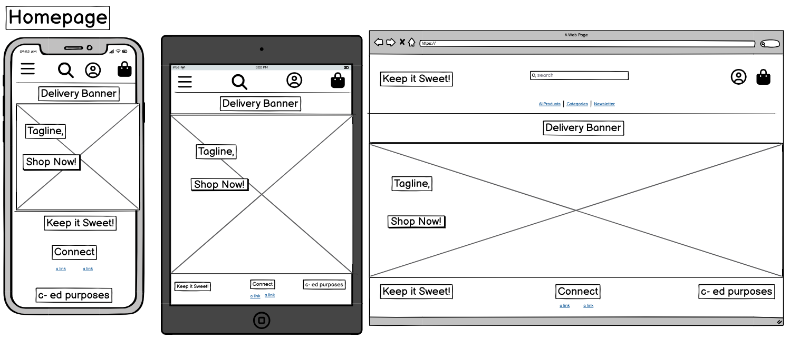

* Products Page
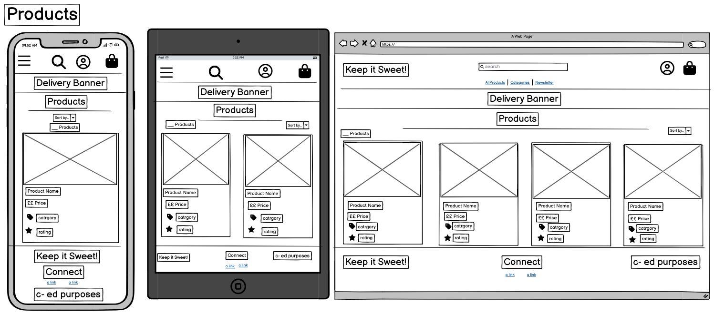

* Product Detail Page
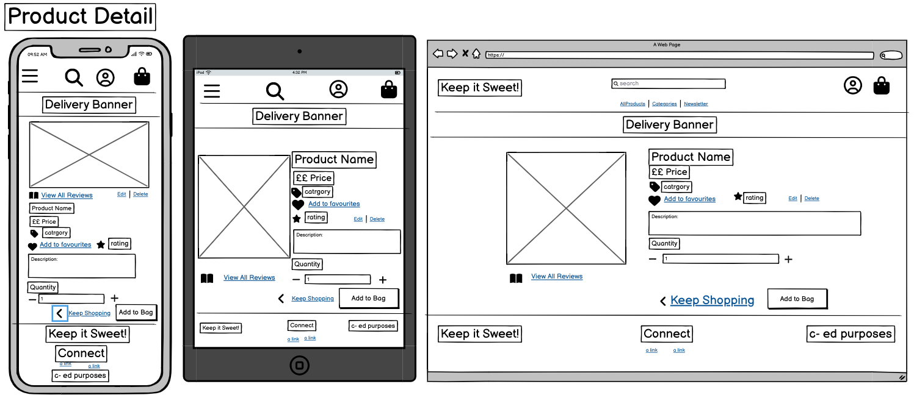

* Bag Page
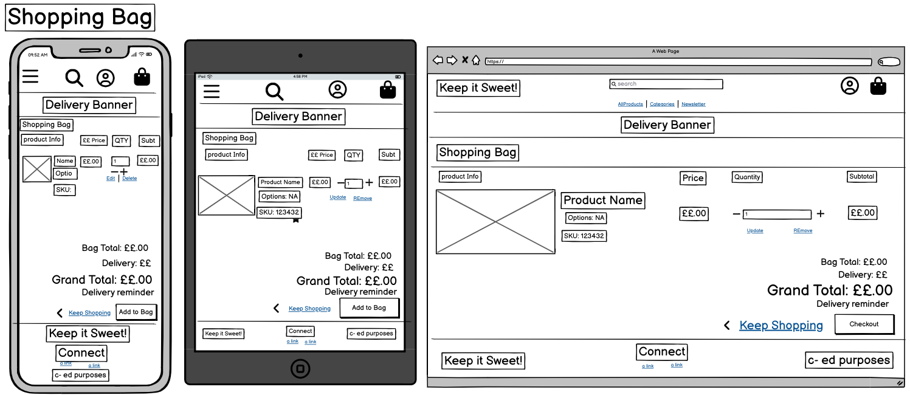

* Checkout Page
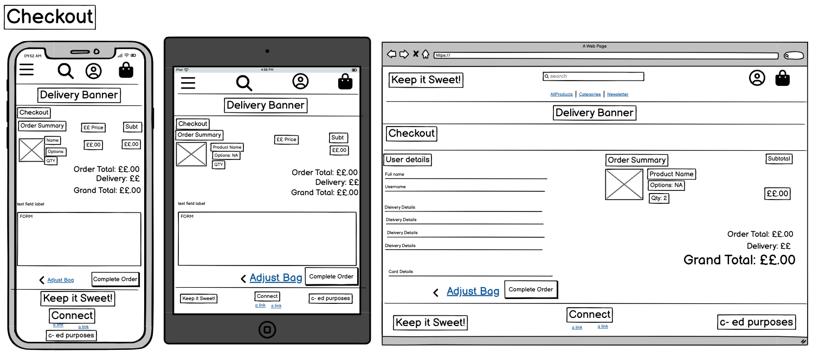

* Checkout Success Page
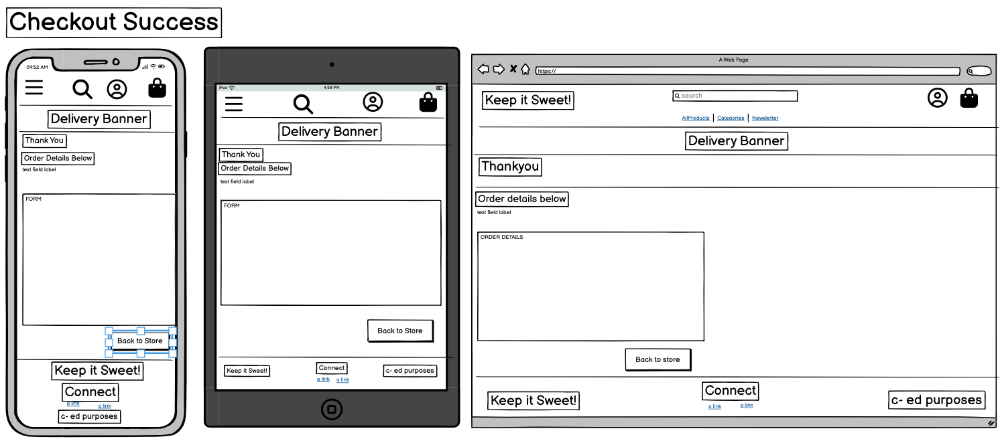

* Favourites Page
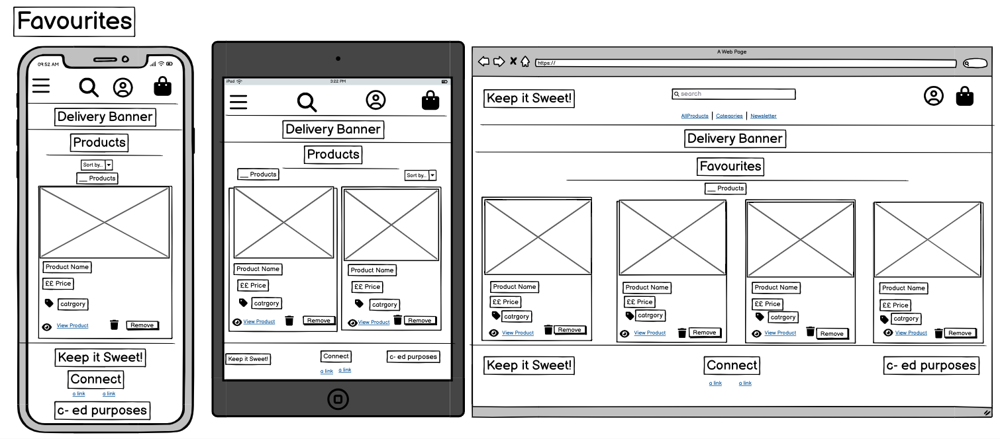

* Profile Page
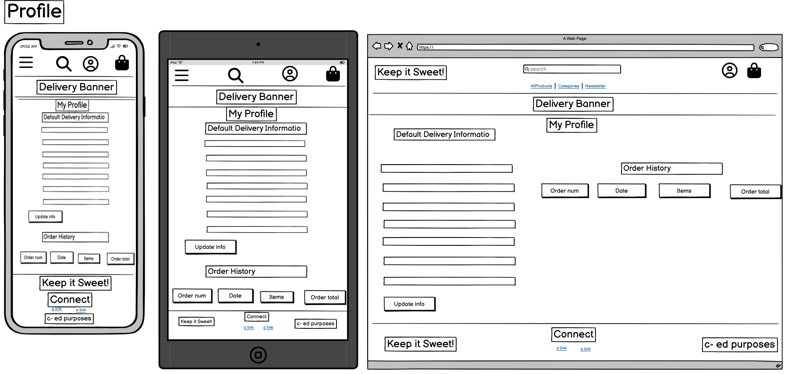

* Reviews Page

* Add/Edit reviews Page
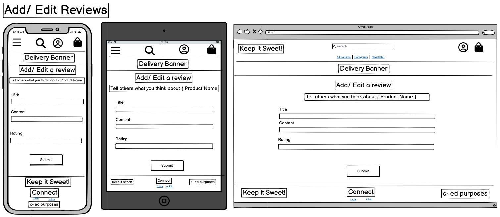

* Product Management Page (Add and Delete)
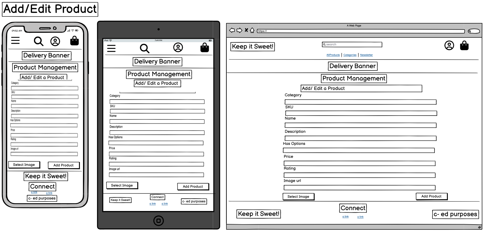

* Register Page
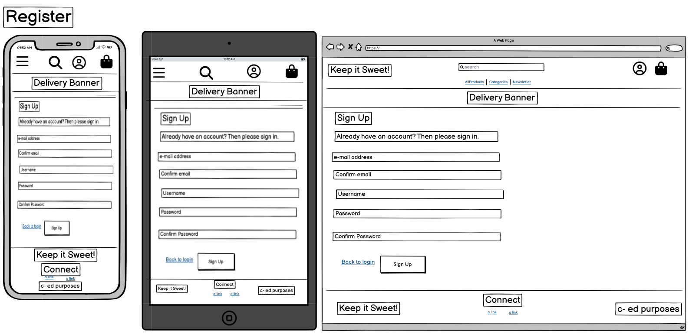

* Login Page
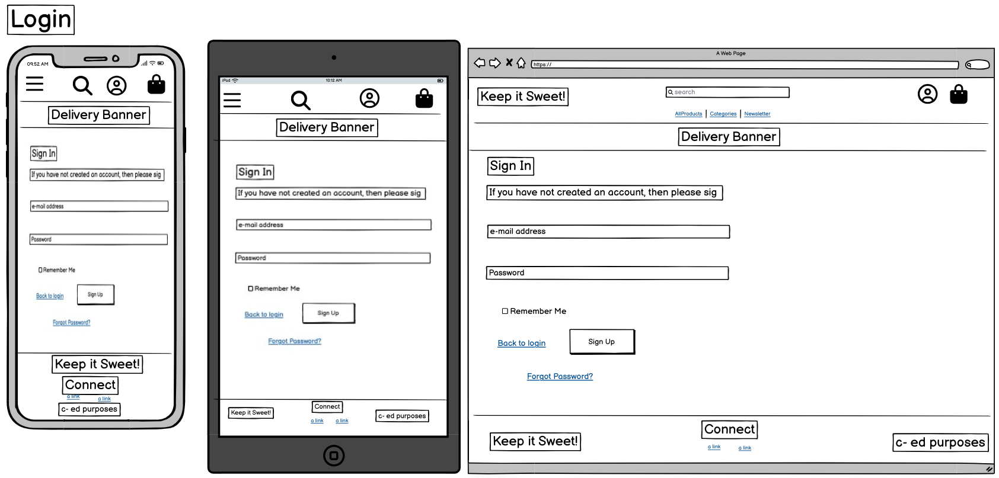

* Newsletter Subscription Page
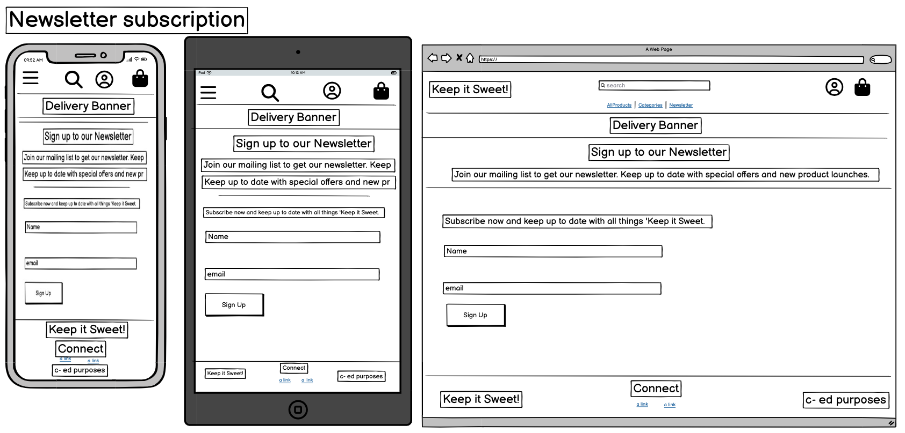

---
## Database
### Relational Database
(This project utilises PostgreSQL, a relational database mangement system (RDBMS) managed by Django which offers PostgreSQL as a service. )

### Entity Relationship Diagram
As illustrated in the ERD, each model corresponds to a database table, and each field corresponds to a column in that table.

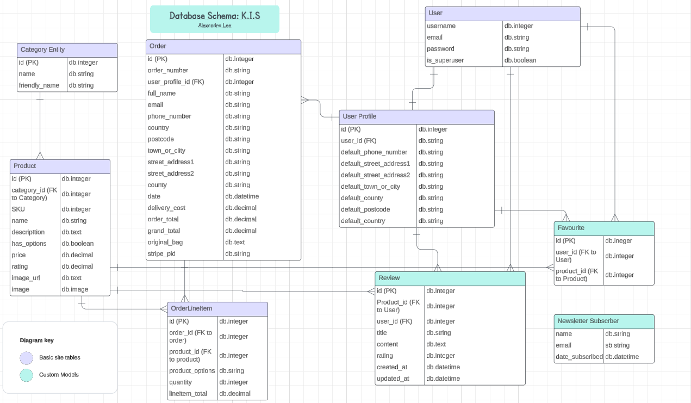

## Models
### Table Description and Relationships

| **Table Name**          | **Purpose**                                                                 | **Relationships**                                                                                          |
|-------------------------|-----------------------------------------------------------------------------|-----------------------------------------------------------------------------------------------------------|
| **User**                | Stores user authentication data, such as username, email, password, and admin status. | - **One-to-One** with `User Profile` (user_id is the foreign key).                                        |
|                         |                                                                             | - **One-to-Many** with `Review` (a user can write many reviews).                                          |
|                         |                                                                             | - **One-to-Many** with `Favourite` (a user can have many favourite products).                             |
| **User Profile**        | Stores additional details for a user, like address and contact information. | - **One-to-One** with `User` (foreign key: `user_id`).                                                    |
|                         |                                                                             | - **One-to-Many** with `Order` (a user profile can have many orders).                                     |
| **Category Entity**     | Represents product categories, like chocolates or candies.                  | - **One-to-Many** with `Product` (a category can have many products).                                     |
| **Product**             | Stores information about products such as name, price, description, and SKU. | - **Many-to-One** with `Category Entity` (foreign key: `category_id`).                                    |
|                         |                                                                             | - **One-to-Many** with `OrderLineItem` (a product can appear in multiple order items).                    |
|                         |                                                                             | - **One-to-Many** with `Review` (a product can have multiple reviews).                                    |
|                         |                                                                             | - **One-to-Many** with `Favourite` (a product can be favourited by many users).                           |
| **Order**               | Represents a user’s purchase order, including totals, costs, and delivery details. | - **Many-to-One** with `User Profile` (foreign key: `user_profile_id`).                                   |
|                         |                                                                             | - **One-to-Many** with `OrderLineItem` (an order can contain multiple products).                          |
| **OrderLineItem**       | Represents individual items within an order, including quantity and options. | - **Many-to-One** with `Order` (foreign key: `order_id`).                                                 |
|                         |                                                                             | - **Many-to-One** with `Product` (foreign key: `product_id`).                                             |
| **Review**              | Stores user-generated reviews for products, including title, content, and ratings. | - **Many-to-One** with `User` (foreign key: `user_id`).                                                   |
|                         |                                                                             | - **Many-to-One** with `Product` (foreign key: `product_id`).                                             |
| **Favourite**           | Allows users to mark products as favourites.                                | - **Many-to-One** with `User` (foreign key: `user_id`).                                                   |
|                         |                                                                             | - **Many-to-One** with `Product` (foreign key: `product_id`).                                             |
| **Newsletter Subscriber** | Stores email subscriptions for newsletters, including date of subscription. | - Optionally can be **linked** to a `User` for registered users (if a user is specified).                 |

## Features

#### Main Site Features

- **Clear Navigation**: Intuitive navigation allows users to easily browse through different pages, including product categories, the shopping bag, and their profile.
- **Special Offers**: A prominently displayed strapline highlights special offers, in this case,free delivery on orders over a certain amount.
- **Bag Modal**: Users can view their shopping bag contents and total directly on product pages through a modal, streamlining the shopping experience.
- **User Profiles**: Leveraging Django Allauth, registered users can create and manage their accounts, save address information, and view their order history for a personalized experience.
- **Responsive Design**: Fully optimized for a range of device sizes, ensuring a seamless shopping experience on desktops, tablets, and smartphones.
- **Footer with Social Links**: Selected pages feature a footer with links to Keep It Sweet's social media profiles. Future updates will expand the footer to include additional navigation links to internal pages. A current example being the 'Privacy Policy' page.
- **Newsletter Subscription**: Users can subscribe to the Keep It Sweet newsletter to receive updates on the latest products, special offers, and seasonal promotions.
- **Favourites App**: Logged-in users can save their favourite products to a personalized favourites list, making it easy to find and purchase their preferred sweets.
- **Reviews App**: Users can view reviews left by other customers on product pages. Registered users can write, edit, and delete their own reviews to share their experiences with others.
- **Staff Product Management**: Staff users with superuser privileges can add new products, edit existing product details, and manage product information directly within the site through a secure admin interface.

#### Home App
- **Navigation**: Users can easily access product categories, the shopping bag, their profile, Newsletter Subscription and their favourites page. The navigation also includes a **Search Bar** for quick product searches.

- **Hero Image and Strapline**: A vibrant hero image and a main strapline welcome users to Keep It Sweet, showcasing the brand's fun and joyful identity. Special offers or promotions are highlighted here. 

- **Footer**: Includes links to Keep It Sweet’s social media profiles, such as Instagram and Facebook, as well as an email link, along with a copyright statement. There is currently a link to a 'Privacy Policy'. Future updates will expand the footer to include links to all pages, terms and conditions.

#### Product App
- **Product Display**: Users can browse a wide selection of sweets, each displayed with an image, name, price, and star rating. Products are grouped into clear categories, such as "Hard," "Chewy," and "Chocolate," making it easy to find specific treats.

- **Search, Filter, and Sorting**: The app includes a **Search Bar** and options to:
  - Filter products by category.
  - Sort products by price, rating, or category for a customized browsing experience.

- **Product Detail Pages**: Each product has its own detailed page featuring:
  - A larger product image.
  - Full product description, including dietary options.
  - Add-to-bag functionality, including the ability to increase or decrease the quantity.
  - JavaScript ensures the decrement button cannot go below one item.
  - A redirection option to continue shopping for more products.

- **Bag Modal**: Users can view a modal with:
  - A list of products added to their bag, including images, descriptions, and total price.
  - A button to proceed to checkout.
  - The total cost of all items in the bag dynamically calculated.

- **Toast Messages**: Upon adding items to the bag, an automated popup with a Toast message confirms the action was successful and displays the number of items added.

- **Favourites Integration**: Logged-in users can save products to their favourites list directly from the product detail page for quick access later.

- **CRUD Functionality for Staff**: Staff users can:
  - Add, edit, and delete products through the admin interface.
  - Manage product information and ensure the catalog is up-to-date.

- **Responsive Design**: The product pages are fully optimized for all device sizes, ensuring a smooth user experience on mobile, tablet, and desktop screens.

#### Bag App

- **Product Summary Page**: Displays a detailed list of products selected for purchase, including:
  - Product images, names, and prices.
  - Options to increase or decrease the quantity of each item.
  - A **Remove Link** to delete items from the bag if needed.
- **Delivery Costs and Free Delivery Threshold**:
  - Users can view the delivery costs based on their current total.
  - A notification advises how much more needs to be spent to qualify for free delivery.
  - If the minimum spend for free delivery is not reached, the applicable delivery costs are clearly displayed.
- **Secure Checkout**: A **Secure Checkout** button allows users to proceed directly to the checkout page to complete their purchase.
- **Bag Modal Integration**: The app integrates seamlessly with the bag modal, dynamically updating the total cost and items in real-time as changes are made on the product summary page.
- **Responsive Design**: Fully optimized for all device sizes, ensuring users can manage their bag easily on mobile, tablet, and desktop screens.

#### Checkout App

- **Order Completion**: Users finalize their purchase by:
  - Filling out a form with delivery and payment details.
  - Clicking the **Complete Order** button to confirm the order.
  - Having the ability to adjust the bag contents right up until the final action.
  - Being informed of the total amount to be charged to their card before finalizing the purchase.

- **Payment Integration**: The app integrates with the **Stripe** payment solution to securely process payments.

- **Order Management**:
  - A bag session is stored in the database, with order details added to the order table for record-keeping.
  - Users can save their delivery and order details, which are linked to their profile.

- **Order History**: 
  - Registered users can view their previous orders in the **Order History** section of their profile.
  - This feature allows users to track past purchases and easily reorder items if needed.

- **Email Confirmation**:
  - Users receive an order confirmation email in their inbox, including:
    - The order number for reference.
    - A summary of their purchase.
  - This provides assurance and a record of the transaction.

- **Responsive Design**: The checkout process is fully optimized for all device sizes, ensuring users can complete their orders seamlessly on mobile, tablet, and desktop screens.

#### Sign-up/Login

- **Sign-in Page**:
  - Allows existing users to log into their account by entering their username and password.
  - Includes a link to the **Reset Password** page for users who have forgotten their password.
  - Provides links to return to the **Home Page** for easy navigation if needed.

- **Sign-up for New Users**:
  - Anonymous users can create an account by entering their email address and setting a secure password in the relevant fields.
  - **Toast Messages** notify users of the status of their login or sign-up process, providing immediate feedback on success or errors.

- **Account Verification**:
  - New customers receive an email with a verification link.
  - Users must click the link to confirm their email address and complete the sign-up process, ensuring account security.

- **Responsive Design**:
  - The sign-up and login pages are fully optimized for all device sizes, ensuring users can access and manage their accounts easily on mobile, tablet, and desktop screens.

#### Admin Features

- **Secure Access**:
  - CRUD functionality is protected by the Django `@login_required` decorator, ensuring only logged-in users with superuser permissions can access product management features.
  - Anonymous users or users without superuser privileges cannot access or modify the data store.

- **Add Product**:
  - Superusers can add new products via a dedicated **Product Management Form**.
  - The form includes fields for **Category**, **SKU**, **Name**, **Description**, **Options**, **Price**, **Rating**, and **Image URL**.
  - Optional fields are clearly marked with an asterisk (`*`).
  - If no image is provided, a default image is automatically applied.

- **Edit Product**:
  - Superusers can edit existing products by using the **Edit Link** on the product page, which opens the product's details in an editable form.
  - A **Toast Feedback Modal** informs superusers that they are in edit mode.
  - Product details can be updated and saved with immediate effect, ensuring the catalog remains accurate and up-to-date.

- **Delete Product**:
  - Superusers can delete a product by clicking the **Delete Link** on the product page.
  - Upon deletion, a **Toast Notification** confirms that the product was successfully removed.
  - Deletion is immediate, streamlining the process of managing outdated or incorrect products.

These admin features ensure efficient and secure management of the product catalog, empowering superusers to maintain the integrity and quality of the online store.

#### Subscribe App

- **Subscription Features**:
  - Both unregistered and registered users can sign up to join the **Keep It Sweet** mailing list.
  - Users are required to provide their email address to subscribe.
  - Upon successful sign-up, a **Success Message** is displayed to confirm the action.

- **Validation and Error Handling**:
  - The app validates user input to ensure the email address is valid and all required fields are completed.
  - Users are shown **Warning Messages** if the email is invalid or a required field is missing.

- **Admin Management**:
  - Subscription records are saved in the admin area for easy management.
  - Details such as **Name**, **Email Address**, **Date Subscribed**,  are recorded and accessible by admin users.

This app enables seamless management of the mailing list and provides users with an efficient way to stay updated on the latest products and offers from Keep It Sweet.

#### Favourites App

- **Save Favourite Products**:
  - Registered users can add products to their favourites list by clicking the **Add to Favourites** button on product pages.
  - The favourites feature allows users to easily revisit and purchase their preferred sweets without needing to search for them again.

- **Manage Favourites**:
  - Users can view their saved favourites in a dedicated **Favourites Page**, which displays:
    - Product images.
    - Names and prices of their saved products.
  - Products can be removed from the favourites list with a single click.

- **Personalized Experience**:
  - Each user's favourites list is unique to their account, ensuring a personalized experience.
  - The favourites list is accessible after logging in and persists across sessions.

- **Responsive Design**:
  - The favourites functionality is fully optimized for all device sizes, allowing users to manage their favourites on mobile, tablet, and desktop screens.

This app provides users with a convenient way to save and organize their favourite products, enhancing the overall shopping experience on **Keep It Sweet**.

#### Reviews App

- **View Reviews**:
  - All users, whether registered or not, can view product reviews on product detail pages.
  - Reviews provide insights into the experiences of other customers, helping users make informed decisions.

- **Write Reviews**:
  - Registered users can submit reviews for products they have purchased.
  - Reviews include a title, content, and a star rating to give detailed feedback.

- **Manage Reviews**:
  - Registered users can manage their reviews with the following features:
    - **Edit Reviews**: Users can update their existing reviews to correct or change their feedback.
    - **Delete Reviews**: Users can remove their reviews if they choose to.

- **Feedback and Validation**:
  - Forms include validation to ensure required fields are completed before submission.
  - Toast messages provide users with immediate feedback when their reviews are successfully submitted, updated, or deleted.

- **Responsive Design**:
  - The reviews functionality is fully optimized for mobile, tablet, and desktop devices, ensuring a seamless experience across all platforms.

The **Reviews App** adds a layer of community interaction to the **Keep It Sweet** site, fostering trust and engagement through customer feedback.

#### Future Features
- A rewards app where purchases make points for freebies and spcial offers.
- A 'Special Offers' / 'Bundle Builder' app where users can bundle an number of products together and get a discount.
- Additional content on the home page with featured or new/ seasonal products promoted beneath the hero section.

## Technologies Used

### Front-End Technologies

- 
    - [HTML5](https://developer.mozilla.org/en-US/docs/Web/Guide/HTML/HTML5) - Used as the base for markup text.
- 
    - [CSS3](https://developer.mozilla.org/en-US/docs/Web/CSS/CSS3) - Used as the base for cascading styles.
- 
    - [jQuery 3.4.1](https://code.jquery.com/jquery/) - Used as the primary JavaScript functionality.
- 
    - [Bootstrap 4.6](https://getbootstrap.com/docs/4.6/getting-started/introduction/) - Used as the front-end framework for layout and design.
- 
    - [Stripe API](https://stripe.com/docs/api?lang=python) - Used to make secured payments on *The Nutritionist*.
- 
    - [Amazon AWS S3](https://aws.amazon.com/) - Used to store *staticfiles* and *media* folders and files.

### Back-End Technologies

- 
    - [Python 3.6.7](https://www.python.org/) - Used as the back-end programming language.
- 
    - [Django 2.2.16](https://docs.djangoproject.com/en/2.2/) - Used as my Python web framework.
- 
    - [Heroku](https://www.heroku.com) - Used for *"Platform as a Service"* (PaaS) for app hosting.
- 
    - [PostgreSQL 11.4](https://www.postgresql.org/) - Used as relational SQL database via [ElephantSQL](https://www.elephantsql.com/).

### Additional Technologies

1. [Google Fonts:](https://fonts.google.com/)
    - Google fonts were used to import the 'Poppins' font used on all pages throughout the project.
1. [Font Awesome:](https://fontawesome.com/)
    - Font Awesome was used on all pages throughout the website to add icons for aesthetic and UX purposes.
1. [Git](https://git-scm.com/)
    - Git was used for version control by utilizing the Gitpod terminal to commit to Git and Push to GitHub.
1. [GitHub:](https://github.com/)
    - GitHub was used to store the projects code after being pushed from Git.

## Testing
Please refer to the [TESTING.md](./TESTING.md) file for full testing and results for:
* Automated Testing and Validation.
* Manual Testing including 'User Stories' Testing and 'Full Feature' testing.
* Fixed Bugs from throughout the development and testing phases.
* Known Bugs.

## Deployment
Please refer to the [DEPLOYMENT.md](./DEPLOYMENT.md) file for a full description and process for:
* Creating a production database, ready for deployment.
* Deploying the project to Heroku.
* Setting up and using *AmazonS3* for hosting the static and media files.

## Credits
### Code
* Credit to [Code Institute's](https://codeinstitute.net/) Boutique Ado walkthrough, from which this project got its start.
* Credit to [Very Academy YouTube Channel](https://www.youtube.com/c/veryacademy) for the very detailed insights on database models.
* Credit to [Joy Zadan's 'Shop K-Beauty'](https://github.com/JoyZadan/shop-kbeauty/tree/main). Her e-commerce gave me some help with the 'Favourites' app and the structure of my README.md.
* Credit to [Rachael Furlong's 'Nutritionist'](https://github.com/RachelFurlong-dev/nutritionist-m4/tree/main). Her e-commerce gave me some help with the 'Newsletter' subscribe app and how to tackle the 'Options' element- thinking creatively about how to have options without creating issues with price!.
* Credit to [The Django Project- Documentation](https://docs.djangoproject.com/en/5.1/). This was used numerous times throughout the project to fix errors or enhance functionality.
* Credit to [Page Speed Checklist *.com*](https://pagespeedchecklist.com/). This was used numerous times throughout the project to fix errors or enhance functionality particularly around 'Performance' and 'Best Practices' in relation to Lighthouse testing.
* Credit to [Coders Camp](https://www.thecoderscamp.com/) who had a number of articles about migrating and databases which helped me with some errors along the way.
* Credit to the gang at tutor Support- Thomas, Roman and Osin who have the patience of saints and have helped with a number of niggles including dependency related issues and lost environment variables.

### Content

-   Product names were made up by the developer. I used chatgpt to author 'Product Descriptions' for all products and a generic 'Stripe Cookies' Policy.

-   [Lucid Chart](https://www.lucidchart.com/pages/) Was used to create the Entity Relationship Daigram and the Screen Shots in my User Stories and Features testing.

### Media

-   All images of products are sourced from UnSplash https://unsplash.com/

### Acknowledgements

-   All the gang at  at Code Institute Tutor Support for help with errors.

-   Rachel Furlong @EKC group for her guidance and support throughout the project.

-   My Mentor Excellence Illesami for helpful feedback.

-   My partner Roman Taylor. He has supported me throughout the course, allowing me to focus, offering feedback and picking me up when I've felt less than resilliant. 