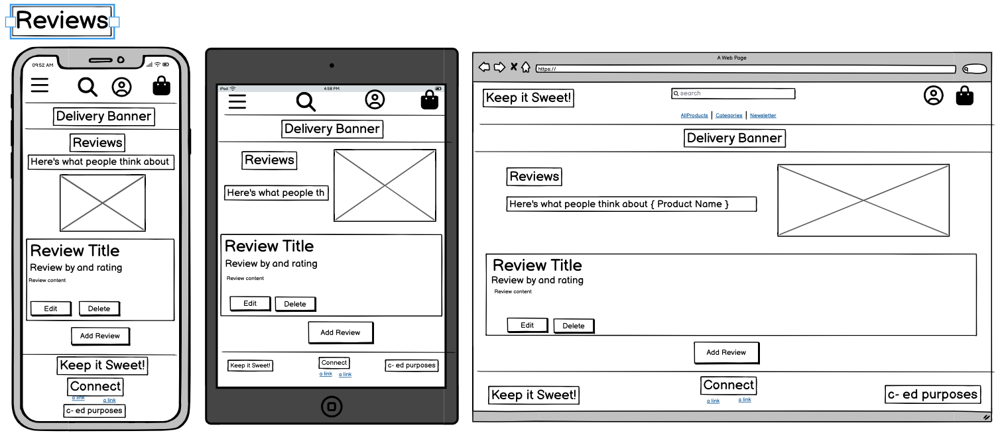

# **Keep It Sweet**

**[Link to the Deployed Site](#)**

- models

# Project Overview

Keep It Sweet is a fictitious, ecommerce full stack project built using Django, Python, JavaScript and Bootstrap 4. The site is deployed to Heroku, uses Amazon S3 for cloud storage and Stripe for payment processing.

It has been produced as my fourth milestone project for Code Institute's Level 5 Diploma in Web Application Development (Full Stack Software Development).
 

---

## TABLE OF CONTENTS

* [User Experience](#user-experience)
    * [User Stories](#user-stories)
* [Design](#design)    
    * [Typography](#typography)
    * [Colour Scheme](#colour-scheme)
    * [Wireframes](#wireframes)
* [Database Design](#database-design)
    * [Relational Database](#relational-database)
    * [Entity Relationship Diagram](#entity-relationship-diagram)
* [Models](#models)
    * [Custom Models](#custom-models)
* [Features](#features)
* [Technologies Used](#technologies-used)
    * [Front End Technologies](#front-end-technologies)
    * [Back End Technologies](#back-end-technologies)
    * [Additional Technologies](#additional-technologies)
* [Credits](#credits)
    * [Code](#code) 
    * [Content](#content)
    * [Media](#media) 
    * [Acknowledgements](#acknowledgements)

---

## User Experience (UX)

-   ### User stories

| **USER STORY #** | **As a/an** | **I want to be able to...** | **So that I can...** |
| --- | --- | --- | --- |
| **VIEWING & NAVIGATION** |   |   |
| 1 | First time user | Navigate around the site | View a list of products  |
| 2 | First time user | Easily and quickly understand the main purpose and products of the 'Keep it Sweet' company | Be sure I am in the right place for my needs  |
| 3 | First time user | View and search specific categories of products | Quickly access a range of products I may be interested in.  |
| 4 | First time user | View individual product details | Identify the price, description, product reviews, product image.  |
| 5 | First time user | View the total amount of products in my shopping bag | Keep track of spending  |
| 6 | First time user | View customer reviews of previous Keep it Sweet's customers | Feel safe in the knowledge that I will be treated well as a customer and feel confident about my purchase.  |
| **REGISTRATION & USER ACCOUNTS** |   |   |
| 7 | First time user | Easily register for an account | Have a personal account and be able to view my profile |
| 8 | First time user | Recieve an email after the above registration process| Have feedback that my registration was successful |
| 9 | Returning user | Easily log in and log out of my account| Access my personal information |
| 10 | Returning/ frequent user | Have a personalised user profile | Access my stored information, order history, order confirmations (and wishlist/ faves list) |
| **SORTING & SEARCHING** |   |   |
| 11 | First time user | Sort the list of available products | Easily identify categorically sorted products |
| 12 | First time user | Search for a product or multiple products by name, ingredient or description | Find a specific product |
| 13 | First time user | View the search results | Identify products for more research or purchase |
| **PURCHASING & CHECKOUT** |   |   |
| 14 | First time user | Select the quantity of a product when purchasing | Ensure the correct quantity is purchased to meet customer need |
| 15 | First time user | View notifications/ feedback when a product is added to the basket | recieve immediate feedback if action completed |
| 16 | First time user | View items in my basket to be purchased | quickly see the total cost of items |
| 17 | First time user | VEdit/ update the items in my basket and adjust quantities | Ensure my purchase is exactly what I want |
| 18 | First time user | Enter payment information | Checkout with minimal fuss. |
| 19 | First time user | Recieve cnfirmation of my order | know my payment has gone through and that my order is in the system. |
| **SITE ADMIN** |   |   |
| 20 | Store Owner | Add a product | Add new items to my store |
| 21 | Store Owner | Edit/ update a product | Amend a product's information so site info is up to date |
| 22 | Store Owner | Delete a product | Remove items that are no longer for sale |
| **DIGITAL MARKETING** |   |   |
| 23 | Store Owner |     Signpost customers to social media. | Build a community of repeat customers to drive sales |
| 24 | Store Owner |     Signpost customers digital marketing (newsletter) and special offers | Build a community of repeat customers to drive sales |
| # | First time and returning user |     Access social media and marketing and sign up for newsletter | Access special offers |
| **PRODUCT REVIEWS** |   |   |
| # | First time user | View reviews for a product I am viewing | be made aware of previous customer's views |
| # | Returning/ frequent user | Be able to add my own reviews to purchased products | share my experiences of a product I purchased |
| # | Returning/ frequent user | Be able to edit my own reviews to purchased products | maintain control of my published content |
| # | Returning/ frequent user | Be able to delete my own reviews to purchased products | maintain control of my published content |
| **USER FAVOURITES LIST** |   |   |
| # | Returning/ frequent user | Add favourite products to a 'Faves -list' | Access quickly in the future for speedier purchase |
| # | Returning/ frequent user | Remove favourite products to a 'Faves -list' | Keep products I really like and personalise my list to my own tastes |
| **BLOG** |   |   |

---

## Design:

### Typography
 The Poppins font via [Google Fonts:](https://fonts.google.com/) is the main font used throughout the website with Sans Serif as the fallback font in case for any reason the font cannot be displayed in a browser correctly.

### Color Scheme:

### **Wireframes**
The wireframes were created using [Balsamiq](https://balsamiq.cloud/).

* Home Page

* Products Page

* Product Detail Page

* Bag Page

* Checkout Page

* Checkout Success Page

* Favourites Page

* Profile Page

* Reviews Page

* Add/Edit reviews Page

* Product Management Page (Add and Delete)

* Register Page

* Login Page

* Newsletter Subscription Page

---
## Database
### Relational Database
(This project utilises PostgreSQL, a relational database mangement system (RDBMS) managed by Django which offers PostgreSQL as a service. )

### Entity Relationship Diagram
As illustrated in the ERD, each model corresponds to a database table, and each field corresponds to a column in that table.

## Models
### Table Description and Relationships

| **Table Name**          | **Purpose**                                                                 | **Relationships**                                                                                          |
|-------------------------|-----------------------------------------------------------------------------|-----------------------------------------------------------------------------------------------------------|
| **User**                | Stores user authentication data, such as username, email, password, and admin status. | - **One-to-One** with `User Profile` (user_id is the foreign key).                                        |
|                         |                                                                             | - **One-to-Many** with `Review` (a user can write many reviews).                                          |
|                         |                                                                             | - **One-to-Many** with `Favourite` (a user can have many favourite products).                             |
| **User Profile**        | Stores additional details for a user, like address and contact information. | - **One-to-One** with `User` (foreign key: `user_id`).                                                    |
|                         |                                                                             | - **One-to-Many** with `Order` (a user profile can have many orders).                                     |
| **Category Entity**     | Represents product categories, like chocolates or candies.                  | - **One-to-Many** with `Product` (a category can have many products).                                     |
| **Product**             | Stores information about products such as name, price, description, and SKU. | - **Many-to-One** with `Category Entity` (foreign key: `category_id`).                                    |
|                         |                                                                             | - **One-to-Many** with `OrderLineItem` (a product can appear in multiple order items).                    |
|                         |                                                                             | - **One-to-Many** with `Review` (a product can have multiple reviews).                                    |
|                         |                                                                             | - **One-to-Many** with `Favourite` (a product can be favourited by many users).                           |
| **Order**               | Represents a user’s purchase order, including totals, costs, and delivery details. | - **Many-to-One** with `User Profile` (foreign key: `user_profile_id`).                                   |
|                         |                                                                             | - **One-to-Many** with `OrderLineItem` (an order can contain multiple products).                          |
| **OrderLineItem**       | Represents individual items within an order, including quantity and options. | - **Many-to-One** with `Order` (foreign key: `order_id`).                                                 |
|                         |                                                                             | - **Many-to-One** with `Product` (foreign key: `product_id`).                                             |
| **Review**              | Stores user-generated reviews for products, including title, content, and ratings. | - **Many-to-One** with `User` (foreign key: `user_id`).                                                   |
|                         |                                                                             | - **Many-to-One** with `Product` (foreign key: `product_id`).                                             |
| **Favourite**           | Allows users to mark products as favourites.                                | - **Many-to-One** with `User` (foreign key: `user_id`).                                                   |
|                         |                                                                             | - **Many-to-One** with `Product` (foreign key: `product_id`).                                             |
| **Newsletter Subscriber** | Stores email subscriptions for newsletters, including date of subscription. | - Optionally can be **linked** to a `User` for registered users (if a user is specified).                 |

## Features

#### Main site features
- Clear navigation for user to select relevant page.
- A strapline promoting some form of special offer over an indicated amount.
- Bag modal with bag contents and total on product pages. 
- (Allauth utilised for profile account features, allowing to  save address information and  order history.)
- Responsive on all device sizes.
- A footer has been added to selected pages, with company social links to social media sites. The footer will be developed in the future to include additional navigation  links to internal pages.

#### Home App
The navigation allows users to select products, blog, checkout and profile pages. Navigation also has a Search bar and Menu dropdowns to sort products into price, category or by rating.
Hero image and main strapline provides information about the brand and its purpose.
Footer with social icons to the brand’s Pinterest and Instagram pages and copyright statement. The footer will be developed into a section containing links to all pages, terms and conditions and cookies statement.

#### Product App
Item_list [CRUD]
Select products of in a specific category (Nuts, seeds, mixes fruits & berries or coated fruit.
Sort the products by price, rating or category and add products to the bag - view the total cost of item in the modal box.
Products page layout shows the images of the various products, name, price, category and star rating.
Product detail pages allow the user to find out more about the product, add a product to the bag and increase or decrease the number of products selected. Users can redirect to the shopping page to view additional products to buy. Additional JavaScript code ensures that the decrement button is disabled from going below one item.
On adding the item to the bag, a user sees an automated popup with a Toast message providing feedback to the user confirming the action was successful and how many of that product were added to the bag. The user can also see a list of previous products if they have already been added to the bag, together with an image, description, total price, and a button to go to the checkout page for payment.

#### Bag App
The product summary page provides a list of products selected for purchase with options to increase or decrease the number of items in the bag, or to delete if required via a remove link.
Users can view delivery costs at this point and are advised of how much more spend is required to reach the minimum spend for free delivery as well as delivery costs if the user does not want to increase spend. 
User can proceed to complete purchase via a button stating ‘secure checkout’

#### Checkout App
- To complete the purchase, users complete the form with their delivery and payment details, and click the ‘complete order’ button to finalise. (The user, right to the final action still has the opportunity to adjust the bag contents. If users go ahead with the purchase they are informed for the total amount that will be charged to their card in advance.
- Payments are made via the Stripe payment solution integrated with the app..
A bag session is stored in the database with order details added to the order table 
- Users can save their order details, so then the database is updated with their profile linked to their order. Users on subsequent logins can view their previous orders in order history on their profile page.
- Users receive an email to their inbox to confirm their order and are provided with  the order number. 

#### Sign-up/Login
- The sign-in page allows users to log into their account by filling a username and a password field correctly. If the user has forgotten their password there is a link to the reset password page as well as links to return to the Home page if required.
- Annonymous users can sign up for an account by adding their email address and setting their passwords in the relevant fields. Toasts keep users informed if thier login has been successful. 
- New customers receive an email to their inbox requesting them to click a link to verify their account to complete sign-up.

#### Admin features:
CRUD functionality
Django @login_required decorator provides protection against anonymous users or users without superuser permissions accessing the data store. Superusers are permitted to Add, Edit and Delete products on the Product Management page on login. 

#### Add Product
There is a form on the product management allowing staff to complete the necessary fields. Category, Sku, Name, Description, Options, Price, rating and Image url. Some fields are optional as indicated by an asterisk next to their name. If no image is selected then a default image is used instead.

#### Edit Product 
Admin superusers can go to an existing product on the product page and use the edit link to provide access to the edit product functionality. There is a Toast feedback modal to alert supersuers to the fact they are editing a product. The details of a product can be amended as required and then updated or removed.

#### Delete Product
Admin superusers can go to an existing product on the product page and use the delete link which on click removes a product immediately, with a feedback popup (Toast) to confirm deletion was successful.

#### Blog App
**Blog Archive page / Blog detail page:**
Posts display an image, an excerpt and a button, and the posts are sorted in date order so the latest published blog is at the top. A button takes the user to the post detail page where all the text and an image are displayed. There is also a button to return the user to the blog archive page.

#### Subscribe App
Unregistered and registered users can sign up to be added to The Nutritionist mailing list. The user signs up and sees a success message if the sign up is successful. The records are saved in the admin area with name, date and date subscribed listed.There are messages that warn the user if the email is invalid or a field is missing.

#### Future Features
- A reviews app is currently in development so that customers will be able to addd reviews to individual  products.
- A Favourites app allowing users to bookmark their favourite products.
- A rewards app where purchases make points for freebies and spcial offers.
- Additional content on the home page with featured or new products promoted beneath the hero section.

## Technologies Used

### Front-End Technologies

- 
    - [HTML5](https://developer.mozilla.org/en-US/docs/Web/Guide/HTML/HTML5) - Used as the base for markup text.
- 
    - [CSS3](https://developer.mozilla.org/en-US/docs/Web/CSS/CSS3) - Used as the base for cascading styles.
- 
    - [jQuery 3.4.1](https://code.jquery.com/jquery/) - Used as the primary JavaScript functionality.
- 
    - [Bootstrap 4.6](https://getbootstrap.com/docs/4.6/getting-started/introduction/) - Used as the front-end framework for layout and design.
- 
    - [Stripe API](https://stripe.com/docs/api?lang=python) - Used to make secured payments on *The Nutritionist*.
- 
    - [Amazon AWS S3](https://aws.amazon.com/) - Used to store *staticfiles* and *media* folders and files.

### Back-End Technologies

- 
    - [Python 3.6.7](https://www.python.org/) - Used as the back-end programming language.
- 
    - [Django 2.2.16](https://docs.djangoproject.com/en/2.2/) - Used as my Python web framework.
- 
    - [Heroku](https://www.heroku.com) - Used for *"Platform as a Service"* (PaaS) for app hosting.
- 
    - [PostgreSQL 11.4](https://www.postgresql.org/) - Used as relational SQL database via [ElephantSQL](https://www.elephantsql.com/).

### Additional Technologies

1. [Google Fonts:](https://fonts.google.com/)
    - Google fonts were used to import the 'Poppins' font used on all pages throughout the project.
1. [Font Awesome:](https://fontawesome.com/)
    - Font Awesome was used on all pages throughout the website to add icons for aesthetic and UX purposes.
1. [Git](https://git-scm.com/)
    - Git was used for version control by utilizing the Gitpod terminal to commit to Git and Push to GitHub.
1. [GitHub:](https://github.com/)
    - GitHub was used to store the projects code after being pushed from Git.

### Code

-   [Bootstrap4](https://getbootstrap.com/docs/4.4/getting-started/introduction/): Bootstrap Library used throughout the project mainly to make site responsive using the Bootstrap Grid System.
- Tutorial by [DjangoCentral](https://djangocentral.com/building-a-blog-application-with-django/) for help with blog development.

- Tutorial by [Python Lessons](https://www.youtube.com/watch?v=wl4Yxo5_Cgw) for help with newsletter sign up development.

- Code Institute Boutique Ado tutorial code used as a basis for project except for custom app development (Blog, Newsletter, Stockists & Reviews).

### Content

-   All content was written by the developer.

### Media

-   homepage-background   https://unsplash.com/photos/assorted-color-candies--vgLTTWPesg

### Acknowledgements

-   My Mentor Tim Nelson for continuous helpful feedback.

-   Martin at Code Institute Tutor Support for help with coding errors.